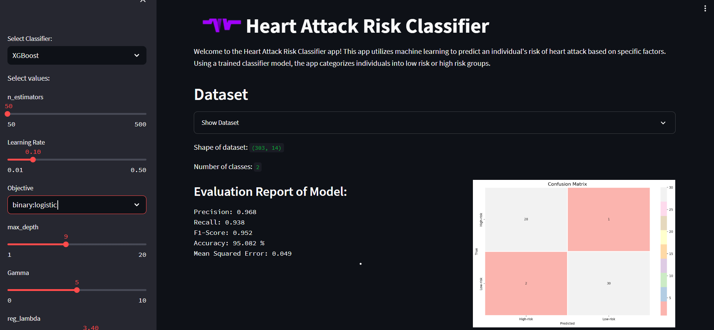

# Heart Attack Risk Classifier
This project is a heart attack risk classification system that uses machine learning algorithms to predict whether an individual is at low or high risk for a heart attack. It provides an interface where users can input their health information, and the system will classify their risk based on the trained models.



## Table of Contents 
- [Dataset](#dataset)
- [Model](#model)
- [Installation](#installation)
- [Contributing](#contributing)
- [License](#license)
- [Contact](#contact)

# Dataset
The heart attack dataset used for training and prediction is loaded from the `heart.csv` file. This dataset contains various features related to heart health, such as age, sex, cholesterol levels, blood pressure, and more. The target variable, "output," indicates the risk level of a heart attack, where 1 represents high risk and 0 represents low risk.

# Model
The heart attack risk classification system utilizes several machine learning algorithms for prediction. The available models include:

- Logistic Regression
- K-Nearest Neighbors (KNN)
- Support Vector Machine (SVM)
- Decision Trees
- Random Forest
- Gradient Boosting
- XGBoost

Each model has its own set of parameters that can be adjusted for fine-tuning the classification performance.
  
# Installation

1. Clone the repository:
```bash
git clone https://github.com/MahtabRanjbar/heart-risk-classifier.git
```

2. Install the required dependencies:

  ```bash
  pip install -r requirements.txt
  ```

3. Run the application:
```bash
streamlit run src/app.py
```

4. Access the application in your web browser at `http://localhost:8501`.

## Contributing
Contributions are always welcome! If you have any ideas or suggestions, please feel free to open an issue or a pull request.

## License
This project is licensed under the MIT License. See the [LICENSE](LICENSE) file for more information


## Contact
If you have any questions or comments about this project, please feel free to contact me at mahtabranjbar93@gmail.com


